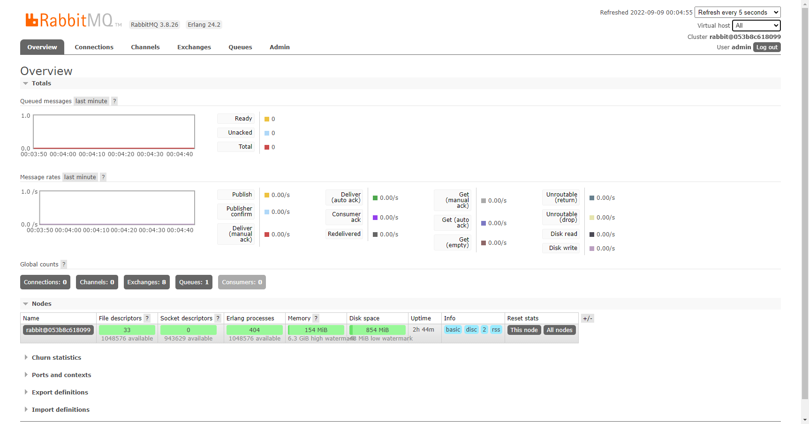
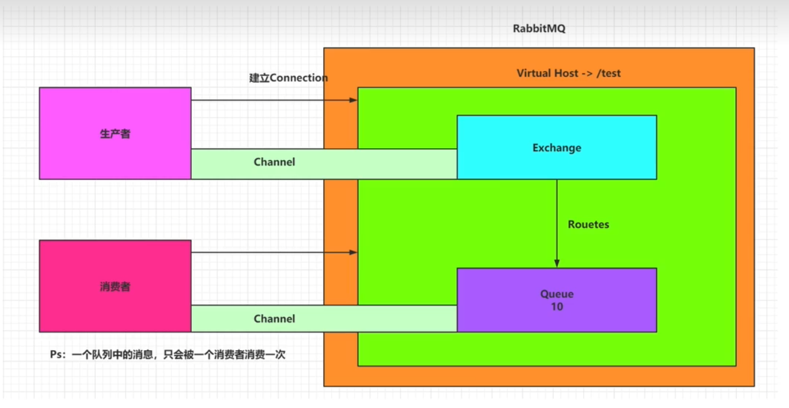

> 消息中间件

- 通信协议
    1. `JMS`即:`JavaMessageService`
        - 类型于`jdbc`是一套接口，规范，目前有两个版本 1.1版本 和 2.0版本
        - 由JAVA定义，不跨平台
        - 消息模型
            - 点对点
            - 点对面
        - 产品:
            - ActiveMQ
            - Kafka
            - WebSphereMQ
    2. `AMQP`即:`Advance Message Queue Protocol`
        - 产品:
            - RabbitMQ
        - 不跨平台
    3. `MQTT`
        - 格式简单，带宽占用小，多用于物联网
    4. `XMPP`
        - 多用于即时通讯
- 重要产品
    - `ActiveMQ`：Apache下的一个子项目
        - `ActiveMQ Classic`：经典版
        - `ActiveMQ Artemis`：在HornetQ基础上开发的，这个版本支持JMS2.0，使用NIO。且支持AMQP，STOMP，MQTT协议
    - `RabbitMQ`
        - 基于Erlang语言开发
        - 生产者发送消息->消息交换机->消息交换机把消息路由到消息队列->消费者从消息队列消费消息
    - `RocketMQ`：阿里开源的项目，主要用于订单系统，性能强
    - `Kafka`：高吞吐，高堆积，主要用于大数据
    - `ZeroMQ`：号称是最快的MQ

---
> Docker安装：后缀带有management的是有web管理页面的版本，没有的是没有web管理页面的版本

 ``` shell
    docker run -d \
        --hostname my-rabbit \
        --name rabbit01 \
        -p 15672:15672 \
        -p 5672:5672 \
        rabbitmq:3-management
```



---


> 基本概念

- 生产者(`Publisher`)：发布消息到`RabbitMQ`中的交换机(`Exchange`)上
- 交换机(`Exchange`)：和生产者建立连接并接受生产者的消息
- 消费者(`Consumer`)：监听`RabbitMQ`中的`Queue`中的消息
- 队列(`Queue`)：`Exchange`将消息分发到指定的`Queue`，`Queue`和消费者进行交互
- 路由(`Routers`)：交换机转发消息到队列的规则

> 名词解释

- `connection`:连接，rabbitmq的操作是基于通道的而不是连接，一个连接可以有多个通道
- `channel`:为了节约资源，rabbitmq的所有操作都是基于通道的，可以将通道声明为publish或者consume
- `routingkey`: 用来标识某个队列的key，可以是某个单词，也可以是点分的词组，如:`i.love.you`
- `exchange`: 交换机，用于将消息(按照一定的规则)投递至指定的队列
    - `direct`: 只有消息的`routingkey`和绑定的`routingkey`完全相同，exchange才会投递消息
    - `topic`: 和direct类型差不多，但direct类型要求`routingkey`完全相等，这里的`routingkey`可以有通配符,`*`,`#` 其中`*`
      表示匹配一个单词, `#`表示多个单词
    - `fanout`: 无须对消息的`routingkey`进行匹配,直接将消息路由到所有绑定的队列中
    - `header`: 根据header来判断,使用较少
- `durable`: 持久化，可以简单的理解为和redis一样，如果不设置持久化，那么断电或者重启mq后消息将丢失
- `autoDelete`: 自动删除，当和这个交换机(或队列)有关的队列全都不再使用时(或消费者全部断开连接时)，自动删除当前交换机(
  或队列)
- `arguments`: 一些其他参数，目前暂不解释
- `queue`: 队列，存储消息的地方(相同名词已在上面解释)
    - `exclusive`: 私有化，为`true`时，则对不同`connection`所创建的`channel`不可见(对相同`connection`创建的`channel`
      是可见的)，反之亦然

---

- `Direct`(直连)交换机：将消息队列绑定到DirectExchange上，当消息到达交换机的时候，消息会携带一个router_key，
  然后交换机会找到名为router_key 的队列，将消息转发到该队列中
- `Fanout`(扇形)交换机：无视routing_key，将消息转发到到所有和该交换机绑定的队列中
- `Topic`(主题)交换机：根据routing_key,来匹配需要投递的队列
- `Header`

> 在spring中使用

- 声明一个队列，并交由容器管理
  ```java
	@Configuration
	public class RabbitConfigure {
	public static final String QUEUE_NAME = "my_queue";
		@Bean
		public Queue queue() {
			/*
			 * 第一个参数:队列名称
			 * 第二个参数：是否持久化到硬盘
			 * 第三个参数：是否具有排他性(队列是由哪个connection创建的就只能由该connection使用)
			 * 第四个参数：是否自动删除(如果该队列没有消费者，是否自动删除该队列)
			 */
			 return new Queue(QUEUE_NAME, true, false, false);
			}
		}
  ```
- 声明一个监听器，用来消费队列中的消息
  ```java
	@Slf4j
	@Component
	public class QueueHandler {
		/**
		* concurrency 指并发数量，将开启n个子线程去消费消息
		*/
		@RabbitListener(queues = RabbitConfigure.QUEUE_NAME,concurrency = "20")
		@RabbitHandler
		public void messageHandler2(Channel channel, Message message) throws IOException {
		String messageStr = new String(message.getBody(), StandardCharsets.UTF_8);
			log.warn("[{}]收到MQ消息:[{}]", "messageHandler2", messageStr);
			//消费成功 参数:消息的唯一标识,是否并发处理
			channel.basicAck(message.getMessageProperties().getDeliveryTag(), false);
			//消费失败 参数:消息的唯一标识,是否并发处理,是否将消息重新放回消息队列中
			channel.basicNack(message.getMessageProperties().getDeliveryTag(), false,true);
			//拒绝消费 参数:消息的唯一标识,是否将消息重新放回消息队列中
			channel.basicReject(message.getMessageProperties().getDeliveryTag(), false);
		}
	}
  ```
- 关闭自动确认消费
  ```properties
   #在消费者的配置文件中设置手动确认消费
   spring.rabbitmq.listener.direct.acknowledge-mode=manual
  ```
- 发送消息
  ```java
    rabbitTemplate.convertAndSend(RabbitConfigure.QUEUE_NAME, "hello,world");
  ```
- 可以设置交换机和队列的绑定关系(绑定关系可以有多个)
  ```java
      @Configuration
      public class RabbitConfigure {
      public static final String QUEUE_NAME = "my_queue";
      public static final String EXCHANGE_NAME = "my_exchange";
      public static final String ROUTING_KEY = "my_routing_key";
          @Bean
          public Queue queue() {
              return new Queue(QUEUE_NAME, true, false, false);
          }
          @Bean
          public Exchange exchange() {
              return new DirectExchange(EXCHANGE_NAME, true, false);
          }
          @Bean
          public Binding binding() {
              return BindingBuilder.bind(queue()).to(exchange()).with(ROUTING_KEY).noargs();
          }
      }
  ```

---
> 单独使用

- 声明一个队列
  ```java
  channel.queueDeclare(Config.QUEUE_NAME, false, false, false, null);
  ```
- 声明一个监听器，用来消费队列中的消息
  ```java
  DefaultConsumer consumer = new DefaultConsumer(channel) {
      //重写消费的方法，其中最后一个参数就是接受到的消息
      @Override
      public void handleDelivery(String consumerTag, Envelope envelope, AMQP.BasicProperties properties, byte[] body) throws IOException {
          super.handleDelivery(consumerTag, envelope, properties, body);
          logger.info("获取到新的消息:[{}]", new String(body, StandardCharsets.UTF_8));
      }
  };
  //声明通道为Consume，autoAck自动应答为true
  channel.basicConsume("queueName", true, consumer);
  ```
- 发送消息
  ```java
  channel.basicPublish(exchange,routing, null, message);
  ```
- 设置交换机和队列的绑定关系(绑定关系可以有多个)
  ```java
  channel.queueBind(Config.QUEUE_NAME, Config.EXCHANGE_NAME, Config.ROUTING_NAME);
  channel.queueBind(Config.QUEUE_NAME2, Config.EXCHANGE_NAME, Config.ROUTING_NAME);
  ```

> rpc调用

- 开启消息失败回退 `spring.rabbitmq.publisher-returns=true`
- 设置消息确认方式 `spring.rabbitmq.publisher-confirm-type=correlated`
- 设置mq响应的队列
    ```java
    @Bean
    public RabbitTemplate rabbitTemplate(ConnectionFactory connectionFactory) {
        RabbitTemplate rabbitTemplate = new RabbitTemplate(connectionFactory);
        rabbitTemplate.setReplyAddress(QUEUE_NAME2);
        rabbitTemplate.setReplyTimeout(6000);
        return rabbitTemplate;
    }
    ```
- 设置mq响应队列的监听
    ```java
    @Bean
    public SimpleMessageListenerContainer simpleMessageListenerContainer(ConnectionFactory connectionFactory) {
        SimpleMessageListenerContainer simpleMessageListenerContainer = new SimpleMessageListenerContainer(connectionFactory);
        simpleMessageListenerContainer.setQueues(queue2());
        simpleMessageListenerContainer.setMessageListener(rabbitTemplate(connectionFactory));
        return simpleMessageListenerContainer;
    }
    ```

> 消息过期时间(两种方式,如果两种都设置了，则以时间短的为准)

1. 对队列统一设置过期时间
    - 创建队列时添加参数`x-message-ttl`
    ```java
        Map<String, Object> args = new HashMap<>();
        args.put("x-message-ttl", 10000);
        return new Queue(QUEUE_NAME2, true, false, false, args);
    ```
2. 对每条消息单独设置过期时间
    - 
    - 手动构建需要发送的消息使用`setExpiration`设置消息过期时间，***参数是字符串***，***单位是毫秒***
    ```java
        //org.springframework.amqp.core.MessageProperties.setExpiration()方法的注释解释了参数为什么是字符串,单位是毫秒
        MessageBuilder.withBody("hello world".getBytes(StandardCharsets.UTF_8)).setExpiration("10000").build();
        rabbitTemplate.convertAndSend(RabbitTtlConfigure.EXCHANGE_NAME, RabbitTtlConfigure.ROUTING_KEY, message);
    ```

---

> 死信队列 死信交换机(dlx)

- 死信队列其实就一个普通的队列。只是我们人为的把它定义为死信队列
- 其他队列中的消息如果需要在过期后放入死信队列，需要在创建队列时增加配置
    ```java
        @Bean(name = "my_rlx_queue")
        public Queue queue() {
            Map<String, Object> args = new HashMap<>();
            args.put("x-dead-letter-exchange","死信交换机名称");
            args.put("x-dead-letter-routing-key","死信队列的routing_key");
            return new Queue(QUEUE_NAME, true, false, false);
        }
    ```

---

> 延迟队列

1. 使用插件`https://github.com/rabbitmq/rabbitmq-delayed-message-exchange`
    - 下载对应版本插件后，放入rabbitmq的plugins目录下，使用`rabbitmq-plugins enable rabbitmq-delayed-message`开启插件
    - 可以使用`rabbitmq-plugins list`查看已经安装的插件列表
        - ***安装插件的时候要注意插件文件的读写权限和所属的用户和组，要不然无法安装***
    - 创建交换机(springboot)，如果需要原生使用，可参照官方文档
        ```java
            @Bean(name = "my_delay_exchange")
            public CustomExchange exchange() {
                Map<String, Object> args = new HashMap<>();
                //指定交换机类型
                args.put("x-delayed-type", "direct");
                return new CustomExchange(EXCHANGE_NAME, "x-delayed-message", true, false, args);
            }
       ```
2. 使用消息过期时间和死信队列
    - 创建两个队列A和B，A不设置消费者，B设置消费者
    - 将需要延迟消费的消息放入队列A，对A里面消息设置设置过期时间
    - 队列A里面的消息过期后，将消息放入队列B
    - 消息到达队列B后被消费者消费，就达到了延迟队列的效果
