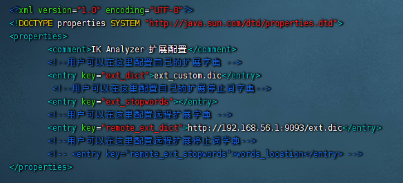
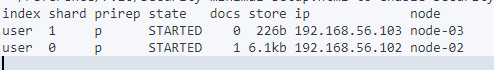

# 201221030

### elasticsearch

> 在linux下启动es需要修改系统配置(注意:es不能使用root用户启动)

- `vim /etc/security/limits.conf`
    - 修改`xxx hard nofile 65536` 其中xxx为运行es的用户名
    - 修改`xxx soft nofile 65536` 其中xxx为运行es的用户名
- `vim /etc/sysctl.conf`
    - 修改`vm.max_map_count=655360`
    - `sysctl -p`使配置生效

```yml
cluster.name: Test #集群名称(同一集群必须保持一致)
node.name: Node-01 #节点名称
network.host: 127.0.0.1 #ip
node.master: true #是否为master节点
http.cors.enabled: true #是否允许跨域(默认情况下集群不支持跨域)
http.cors.allow-origin: "*" #跨域范围
http.port: 9200 #端口号(默认为9200)
#节点列表(老版本使用第一个，新版本使用第二个)
#discovery.zen.ping.unicast.hosts: [ "127.0.0.1" ] #节点列表
discovery.seed_hosts: [ "192.168.56.101","192.168.56.102","192.168.56.103" ]
#初始master节点
cluster.initial_master_nodes: [ "192.168.56.101" ]
```

> 核心概念

1. 集群(`cluster`)`cluster.name: Test`
    - 由一个或多个安装了es节点的服务器组织在一起就是集群
    - 这些节点持有共同数据，共同提供服务
    - 一个集群有一个名字，这个名字是集群的唯一标识，具有相同集群名称的节点才会组成集群
    - 在集群中，节点的状态有三种：绿色、黄色、红色
        - 绿色：节点运行状态为健康状态。所有的主分片、副分片都可以正常工作
        - 黄色：节点的运行状态为警告状态，所有的主分片目前都可以直接运行，但至少有一个副分片是不能正常工作的
        - 红色：表示集群无法正常工作。
2. 节点(`node`)`node.name: node-01`
3. 索引(`index`)
    - 具有相似文档的集合
    - 索引(查询)数据以及对数据进行索引(查询)操作
    - 类似于关系型数据库里的数据库
4. 类型(`type`)
    - 类型是索引上的逻辑分类或者分区
    - 6.x版本之前：一个索引中可以有多个类型
    - 6.x-7.x版本：依然向下兼容一个索引里有多个type，但已经不建议这样使用了
    - 7.x版本之后：一个索引中只能有一个类型
    - 类似于关系型数据库里的数据表
5. 文档(`document`)
    - 一个可以被索引(查询)的数据单元，文档都是json格式
    - 类似于关系型数据库里的一条记录
6. 分片(`shards`)
    - 索引都是存储在节点上的，但是受限于节点的空间大小以及数据处理能力，单个节点的处理效果可能不理想此时可以对索引进行分片，当创建一个索引的时候就需要指定分片数量
    - 每个分片本身也是一个功能完善并且独立的索引
    - 默认情况下，一个索引会自动创建5个分片，并且为每一个分片创建一个副本
7. 副本(`副本`)
    - 副本也就是备份，是对主分片的一个备份
    - 当主分片不可以用时，会自动从副本分片里选取一个成为主分片
8. Settings
    - 集群中对索引的定义信息，例如索引的分片数、副本数等
9. Mapping
    - 保存了定义索引字段的存储类型、分词方式、是否存储等信息
10. Analyzer
    - 字段分词方式的定义

---
其中粗边框为主分片，细边框为副本分片


---
> es和关系型数据库对比

- 索引 => 数据库
- 类型 => 表
- 文档 => 行
- 字段 => 映射
- DSL => SQL
- GET http:// => select * from xxx
- PUT http:// => update xxx set xx=xxx
- DELETE http:// => delete xxx
- 全文索引 => 索引

> 分词器
> Es核心功能就是数据检索，首先通过索引将文档写入es，查询分析则主要分为两个步骤

1. 词条化：分词器将输入的查询文本转为一个一个的词条流
2. 过滤：比如停用过滤词会从词条中去除不相关的词条；另外还有同义词过滤、小写词过滤等

- 内置分词器
    - `Standard Analyzer`:标准分词器，适用于英语等
    - `Simple Analyzer`:简单分词器，基于非字母字符进行分词，单词会被转为小写字母
    - `Whilespace Analyzer`:空格分词器，安装空格进行切分
    - `Stop Analyzer`:类似于简单分词器，但是增加停用词的功能
    - `Keyword Analyzer`:关键词分词器，输入文本等于输出文本
    - `Pattern Analyzer`:利用正则表达式对文本进行切分，支持停用词
    - `Language Analyzer`:针对特定语言的分词器
    - `Fingerprint Analyzer`:指纹分析仪分词器，通过创建标记进行重复检测
- [中文分词器](https://github.com/medcl/elasticsearch-analysis-ik)
    1. 安装方式一
        - [https://github.com/medcl/elasticsearch-analysis-ik](https://github.com/medcl/elasticsearch-analysis-ik)
        - 下载分词器解压到`es/plugins/ik`目录下，重启es服务即可
    2. 安装方式二
        - 直接使用命令
          `./bin/elasticsearch-plugin install https://github.com/medcl/elasticsearch-analysis-ik/releases/download/v6.3.0/elasticsearch-analysis-ik-6.3.0.zip`

    - 自定义拓展词库(集群中每个节点都需要配置)
        1. 本地词库(需要重启es)：
            - 在`es/plugins/ik/config`目录下新建ext_custom.dic文件(文件名任意)
            - 在`es/plugins/ik/config/IKAnalyzer.cfg.xml`文件中配置自定义拓展词库文件
        2. 远程词库(可以热更新，不需要重启es)：
            - 在`es/plugins/ik/config/IKAnalyzer.cfg.xml`文件中配置拓展词库接口
            - 提供一个接口，接口返回拓展词即可
            - 热更新主要是响应头的`Last-Modified`或者`ETag`字段发生变化，ik就会自动重新加载远程拓展词典

---


---

##### 基本操作(所有示例均使用kibana操作，默认省略url)

> 索引管理

- 新建索引`PUT localhost:9200/{index}`
    ```shell
    PUT user
    ```
- 修改副本数量`PUT localhost:9200/{index}/_settings`
    ```shell
    PUT user/_settings
    {
      "number_of_replicas": 2
    }
    ```
- 添加数据`PUT localhost:9200/{index}/_doc/{id}`
    ```shell
    PUT user/_doc/2
    {
      "name":"枕竹知雨韵"
    }
    ```
- 关闭索引的写权限`PUT localhost:9200/{index}/_settings`
    ```shell
    PUT user/_settings
    {
      "blocks.write": false
    }
    ```
- 打开索引的写权限`PUT localhost:9200/{index}/_settings`
    ```shell
    PUT user/_settings
    {
      "blocks.write": true
    }
    ```
- 查看索引信息`GET localhost:9200/{index}/_settings`
    ```shell
    GET user/_settings
    #可同时操作多个，用逗号隔开即可
    GET demo,user/_settings
    ```
- 查看所有索引信息`GET localhost:9200/_all/_settings`
    ```shell
    GET _all/_settings
    ```
- 删除索引`DELETE localhost:9200/{index}`
    ```shell
    DELETE user
    ```
- 关闭索引`POST localhost:9200/{index}/_close`
    ```shell
    POST user/_close
    #可同时操作多个，用逗号隔开即可
    POST user,demo/_close
    ```
- 打开索引`POST localhost:9200/{index}/_open`
    ```shell
    POST user/_open
    #可同时操作多个，用逗号隔开即可
    POST user,demo/_open
    ```
- 复制索引`POST localhost:9200/_reindex`
    ```shell
    #只会复制索引的数据，不会复制索引的信息
    #复制的时候可以添加查询条件
    POST _reindex
    {
      "source": {"index": "user"},
      "dest": {"index": "user_01"}
    }
    ```
- 添加别名`POST localhost:9200/_aliases`
    ```shell
    #如果别名唯一，那么别名可以代替索引名使用
    POST _aliases
    {
      "actions": [
        {
          "add": {
            "index": "user",
            "alias": "person"
          }
        }
      ]
    }
    ```
- 删除别名`POST localhost:9200/_aliases`
    ```shell
    POST _aliases
    {
      "actions": [
        {
          "remove": {
            "index": "user",
            "alias": "person"
          }
        }
      ]
    }
    ```
- 查看索引的别名`GET localhost:9200/_alias`
    ```shell
    GET user/_alias
    ```
- 查看别名对应的索引`GET localhost:9200/{alias}/_alias`
    ```shell
    GET person/_alias
    ```
- 查看所有的别名`GET localhost:9200/_alias`
    ```shell
    GET _alias
    ```

---
> 文档管理

***添加文档***

- 添加文档(手动指定id)`PUT localhost:9200/{index}/_doc/{id}`
   ```shell
   PUT user/_doc/1
    {
      "name":"张三",
      "age":20,
      "birthday":"2022-10-21",
      "description":"这是张三的个人简历"
    }
    ```
- 添加文档(系统生产id)`POST localhost:9200/{index}/_doc`
    ```shell
    POST user/_doc
    {
      "name":"李四",
      "age":22,
      "birthday":"2022-09-21",
      "description":"这是李四的个人简历"
    }
    ```
    - 添加成功后相应的json如下
    ```shell
    {
      #_index：文档所在的索引
      "_index" : "user",
      #_type：文档的类型
      "_type" : "_doc",
      #_id：文档的id
      "_id" : "1",
      #_version：文档的版本(如果更新文档，版本会自动加1)
      "_version" : 1,
      #result：执行结果(created表示新增，update表示更新)
      "result" : "created",
        #_shards：分片信息
        "_shards" : {
        #total：
        "total" : 2,
        #successful：
        "successful" : 2,
        #failed：
        "failed" : 0
      },
      #_seq_no：版本,针对当前index
      "_seq_no" : 0,
      #_primary_term：版本,针对当前index
      "_primary_term" : 1
    }
    
    ```

***查询文档***

- 查询文档`GET localhost:9200/{index}/_doc/{id}`
    ```shell
    GET user/_doc/1
    ```
- 查询文档是否存在`HEAD localhost:9200/{index}/_doc/{id}`
    ```shell
    HEAD user/_doc/1
    ```
- 查询文档`GET localhost:9200/{index}/_doc/{id}`
    ```shell
    GET user/_doc/1
    ```
- 批量查询文档`GET/POST localhost:9200/{index}/_mget`
    ```shell
    #某些特定的语言，例如js的http请求库是不允许get请求携带请求体的
    #在RFC7231文档中并没有规定get请求的请求体该如何处理，这就造成了一定程度的混乱
    #导致了有的http服务器支持get请求携带请求体，有的不支持
    #也导致了一部分人认为get请求不能携带请求体
    #es为了保持兼容性，凡是get请求需要携带请求体的地方，也可以使用post请求
    GET user/_mget
    {
      "ids":["1","2","NZwkLoQBEO8tbTRioJcI"]
    }
    POST user/_mget
    {
      "ids":["1","2","NZwkLoQBEO8tbTRioJcI"]
    }
    ```

***修改(更新),文档每更新一次，_version会自增1***

- 更新文档(覆盖)`PUT localhost:9200/{index}/{id}`
    ```shell
    PUT user/_doc/NZwkLoQBEO8tbTRioJcI
    {
      "gender":"男"
    }
    ```
- 更新部分字段(覆盖)`POST localhost:9200/{index}/_update/{id}`
- 更新部分字段，也可以给文档添加字段(需要使用脚本实现)
    ```shell
    #方式一(使用params传递参数)
    POST user/_update/1
    {
      "script": {
        #lang:脚本语言,painless是es内置的一种脚本语言
        "lang": "painless",
        #source:具体执行的脚本，ctx是一个上下文对象，通过ctx可以访问到该文档的详细信息
        "source": "ctx._source.birthday=params.birthday",
        #params:传入的参数
        "params": {
          "birthday":"2001-01-01"
        }
      }
    }
    ```
    ```shell
    #方式二(直接转义拼接字符串)
    POST user/_update/1
    {
      "script": {
        "lang": "painless",
        "source": "ctx._source.favorite=[\"java\",\"c++\"]"
      }
    }
    ```
- 使用painless脚本语言时可写一些逻辑判断辅助处理(*ctx为上下文对象*)
   ```shell
    POST user/_update/1
    {
      "script": {
        "lang": "painless",
        "source": "ctx._source.favorite.add(\"python\")"
      }
    }
    ```
    ```shell
    POST user/_update/1
    {
      "script": {
        "lang": "painless",
        "source": "if(ctx._source.favorite.contains(params.favorite)){ctx.op=params.true}else{ctx.op=params.false}",
        "params": {
          "favorite":"java",
          "true":"delete",
          "false":"none"
        }
      }
    }
    ```

***删除文档***

- 删除文档(id)`DELETE localhost:9200/{index}/_doc/{id}`
    ```shell
    #如果在添加文档时指定了路由，则删除文档时也需要指定路由，否则删除失败
    DELETE user/_doc/NZwkLoQBEO8tbTRioJcI
    ```
- 删除文档(条件)`POST localhost:9200/{index}/_delete_by_query`
    ```shell
    POST user/_delete_by_query
    {
      "query":{
      "term":{
        "age":22
        }
      }
    }
    ```
- 删除全部文档`POST localhost:9200/{index}/_delete_by_query`
    ```shell
    POST user/_delete_by_query
    {
      "query":{
      "match_all":{}
      }
    }
    ```

---
> 批量操作(通过Bulk API 可以执行批量操作)

***将所有的批量操作写入一个json文件中，然后通过post将该json文件上传并执行***

```shell
# index为一个操作，其他的还有create,delete,update
# 使用create时，如果索引中存在id为1的文档，那么create操作会失败
# 其中index:新建一个索引,_index:索引名称，_id:新建文档的id
{"index":{"_index":"user","_id":"1"}}
#name:新建文档的参数
{"name":"张三"}
#需要进行更新操作
{"update":{"_index":"user","_id":"1"}}
#name:更新文档的参数
{"doc":{"name":"李四"}}
#注意：最后要空出一行

#执行完成后会创建一个名为user的索引，并且添加一条id为1，name为张三的记录
#然后将id为1的记录的name修改为李四
```

---

##### 文档路由`GET _cat/shards/{index}?v`

- 当存储一个数据到es中后，该数据被存储到master节点的某一个主分片上
- 例如新建一个索引，该索引有2个分片，0个副本
- 然后向该索引中保存一个文档，文档保存成功后可以查看该文档被保存到哪一个分片中
    - 通过`GET _cat/shards/user?v`查看后结果如下
    - 
    - 文档被保存到分片0中
    - es中的路由机制是通过hash算法，将具有相同hash值的文档放到一个主分片中，计算方式如下
        - shard=hash(routing) % num_of_primary_shards
        - routing可以是任意字符串，默认为文档的id
        - 通过hash函数根据routing生产一个数字
        - 然后将该数字和分配上取余，最后的结果就是分片的位置
        - 默认的路由模式优势在于负载均衡，可以保证数据平均分配在不同的分片上
        - 但查询的时候无法确定文档的位置，此时会将请求广播到所有的分片上执行
        - 使用默认的路由模式，后期修改分片数量不方便
    - 也可以自定义routing的值，方式如下
    ```shell
    PUT user/_doc/c?routing=wangwu
    {
        "name":"wangwu",
        "age":20,
        "birthday":"2022-10-31"
    }
    ```
    - 如果文档在添加时指定了routing，则查询、删除、更新时也需要指定routing
    - 自定义routing有可能会导致负载不均衡。需要结合时间情况使用

##### 版本控制(es使用的是乐观锁)

> 锁

- 悲观锁 每次读取数据时，都认为别人可能会修改数据，屏蔽一切可能破坏数据完整性的操作。关系型数据库中悲观锁使用较多，如：行锁、表锁等
- 乐观锁 每次读取数据时，都认为别人不会修改数据，不锁定数据，只有在提交时才检查数据完整行。这种方式可以省去锁的开销，进而提升吞吐量

> 版本控制

在es6.7之前，使用version+version_type 来进行乐观并发控制。文档每被修改一次，version就会自增1，es通过version字段来确保所以的操作有序进行

- 内部版本
    - es自己维护的就是内部版本，当创建一个文档时，es会给文档的版本赋值为1
    - 每当用户修改一次文档，版本号就会自增1
    - 如果使用内部版本，es要求version参数的值必须和es文档中的version一致才能操作成功
- 外部版本
    - 在添加文档时手动指定版本号
    - `version_type=external` 或者 `version_type=external_gt` 表示以后更新的时候版本号要大于当前版本号
    - `version_type=external_gte` 表示以后更新的时候，版本号要大于等于当前版本号

在es6.7之后，使用if_seq_no和if_primary_term两个参数来来做

### kibana
